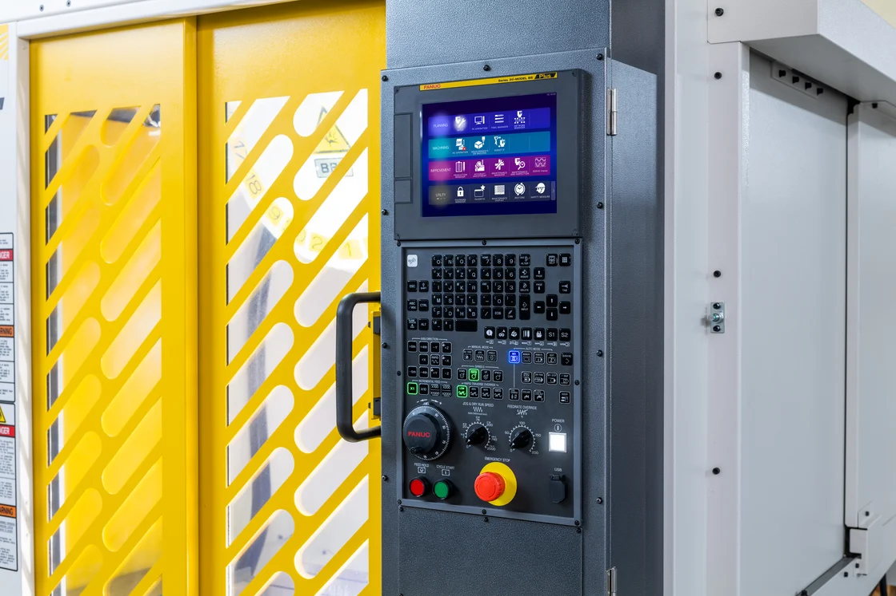
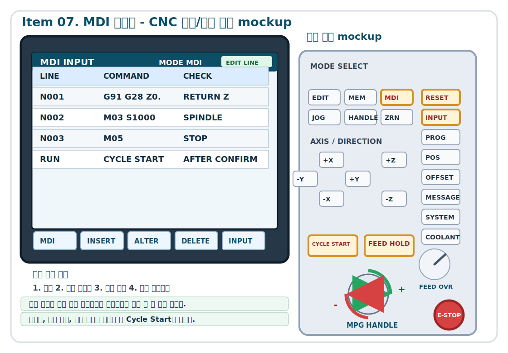
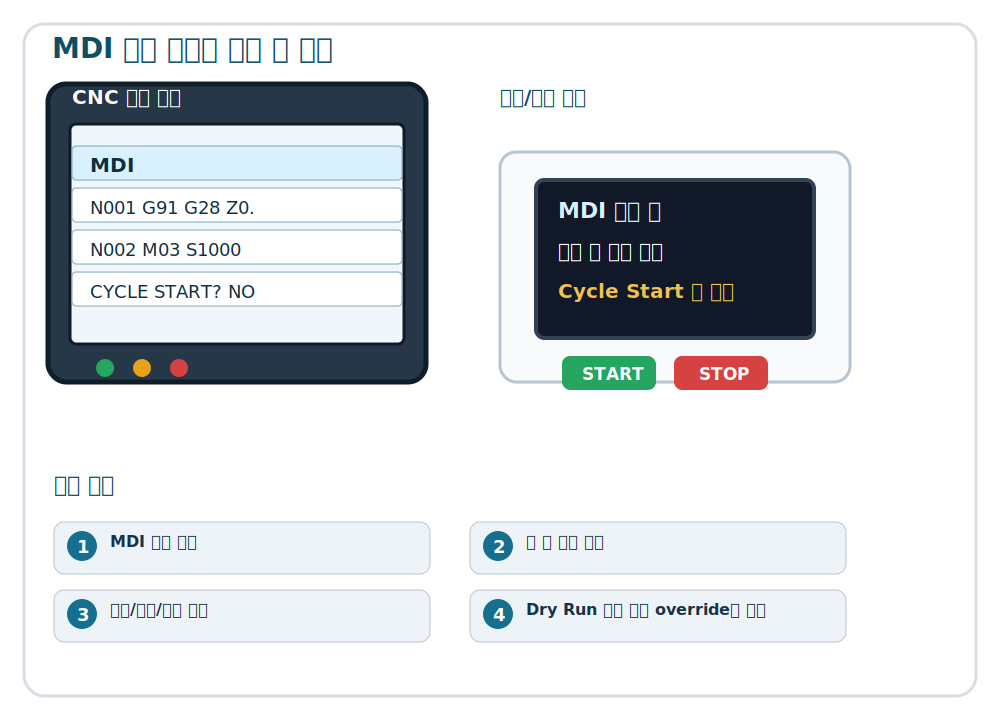

<section class="cover">

<h1>FANUC ROBODRILL 기초과정</h1>

Level 1 - Item 07 MDI 사용법

<strong>대상</strong>ROBODRILL을 처음 다루는 작업자, 품질 담당자, 설비 담당자
<strong>목표</strong>짧은 명령을 직접 입력할 때의 확인 절차와 실행 위험을 이해한다.
<strong>형식</strong>교육 목표, 안전사항, 실제 이미지, 절차, 실습, 시험 문제

</section>

[PAGE_BREAK]

# 07. MDI 사용법

이 항목은 MDI 사용법을 초보자가 안전하게 이해하고 현장에서 설명할 수 있도록 만든 수업 단위이다. 짧은 명령을 직접 입력할 때의 확인 절차와 실행 위험을 이해한다. 조작자는 버튼 이름을 외우는 것보다 현재 장비 상태, 다음 동작, 위험 위치를 먼저 확인해야 한다. 모든 절차는 확인, 선택, 실행, 관찰, 기록의 순서로 진행한다.

> 안전 주의: 실제 장비 조작은 반드시 현장 안전 규정, 제조사 매뉴얼, 사내 작업표준서, 지도자의 지시에 따른다. 확신이 없으면 멈추고 상태를 보고한다.

## 교육 목표

- 짧은 명령을 직접 입력할 때의 확인 절차와 실행 위험을 이해한다.
- 관련 버튼, 화면 표시, 장비 반응을 말로 설명한다.
- 조작 전 안전 확인 항목을 체크리스트로 점검한다.
- 정상 상태와 이상 상태를 구분해 지도자에게 보고한다.
- 실습 결과를 작업 기록지에 남긴다.

| 구분 | 학습자가 해야 할 행동 | 통과 기준 |
| --- | --- | --- |
| 이해 | MDI 사용법의 목적을 설명한다 | 핵심 용어 3개 이상을 사용한다 |
| 확인 | 조작 전 위험 요소를 찾는다 | 작업 영역, 화면, 오버라이드를 확인한다 |
| 실행 | 지도자 감독하에 단계별로 수행한다 | 빠른 조작 없이 멈춤과 확인을 반복한다 |
| 기록 | 결과와 이상 여부를 적는다 | 날짜, 장비 상태, 확인자를 남긴다 |

[PAGE_BREAK]

## 안전사항

MDI 사용법에서 가장 위험한 순간은 작업자가 장비 상태를 확인하지 않고 다음 동작을 실행할 때이다. 특히 주축, 축 이동, 공구 교환, 좌표 입력, 프로그램 실행은 화면 조작이 실제 기계 움직임으로 연결된다. 초보자는 화면의 숫자와 실제 공구 위치를 항상 함께 보아야 한다.

이 항목의 학습 도해를 먼저 읽고, 화면에서 어떤 상태를 확인해야 하는지와 실제 장비에서 어느 부분이 움직일 수 있는지를 연결해 설명한다. 그림을 읽지 못하면 조작을 시작하지 않는다.

| 위험 상황 | 발생 원인 | 예방 행동 |
| --- | --- | --- |
| 예상과 다른 축 이동 | 축 선택, 방향, 좌표계를 혼동함 | 움직일 축과 방향을 말로 확인한다 |
| 충돌 | 공구, 소재, 지그 간격을 보지 않음 | 낮은 속도와 짧은 이동으로 접근한다 |
| 재시작 오류 | 알람 원인을 확인하지 않음 | 알람 번호와 발생 조건을 기록한다 |
| 품질 불량 | 보정값이나 기준면을 놓침 | 작업 전 기록과 화면 값을 대조한다 |

> 안전 주의: 비상정지는 마지막 방어 수단이다. 비상정지를 누를 상황을 만들기 전에 오버라이드를 낮추고, 의심되면 정지한 뒤 확인한다.

[PAGE_BREAK]

## 실제 이미지와 관찰 포인트

그림 7-1. MDI 사용법 교육용 참고 이미지. 출처와 사용권은 이미지 출처 문서에 기록한다.

이미지를 볼 때는 장비 전체를 한 번에 보려 하지 말고 작업자에게 영향을 주는 위치부터 확인한다. 첫째, 손과 몸이 들어갈 수 있는 위험 구간을 찾는다. 둘째, 버튼 또는 화면 조작이 어떤 장치의 움직임으로 이어지는지 연결한다. 셋째, 이상이 생겼을 때 즉시 멈출 수 있는 위치를 확인한다.

그림 7-2. MDI 사용법 수업에서 읽어야 할 CNC 화면 값과 확인해야 할 조작 패널 위치를 함께 표시한 mockup.

이 mockup은 실제 장비 조작 전에 화면에서 먼저 읽어야 할 모드, 상태, 좌표, 프로그램, 오프셋, 알람 값을 훈련하기 위한 것이다. 오른쪽 패널에서는 해당 항목에서 눌러야 하거나 반드시 확인해야 하는 버튼과 다이얼을 강조한다. 실제 장비의 화면 구성은 옵션과 버전에 따라 다를 수 있으므로, 수업 중에는 같은 의미의 표시 위치를 현장 장비에서 다시 찾는다.

그림 7-3. MDI 사용법의 조작 순서와 실제 움직임을 함께 보는 학습용 도해.

도해는 장식용 그림이 아니라 실습 전에 읽어야 하는 작업 지도이다. 왼쪽의 CNC 화면 예시에서 모드, 선택된 축, 프로그램 번호, 오프셋 값 같은 문자를 먼저 읽고, 오른쪽의 동작 그림에서 실제로 움직일 장치와 방향을 확인한다. 아래 학습 순서는 지도자에게 말로 보고한 뒤 한 단계씩 수행한다.

## 핵심 개념

MDI 사용법의 핵심은 절차 자체보다 절차가 필요한 이유를 이해하는 것이다. ROBODRILL은 작고 빠른 장비이므로 작은 확인 누락도 빠른 충돌이나 품질 문제로 이어질 수 있다. 따라서 초급 과정에서는 정확한 가공 조건보다 안전한 관찰 습관을 먼저 고정한다.

위 기능 도해에서 화면 예시, 움직임 방향, 학습 순서를 각각 손으로 짚으며 설명한다. 특히 숫자나 모드 표시는 실제 장비 화면의 같은 위치에서 다시 확인해야 한다.

| 핵심 용어 | 의미 | 현장 확인 |
| --- | --- | --- |
| 상태 확인 | 장비가 어떤 모드와 조건인지 읽는 것 | 화면, 램프, 알람, 오버라이드 |
| 실행 조건 | 기계가 움직일 수 있는 준비 상태 | 도어, Servo, 좌표, 공구 |
| 관찰 거리 | 공구와 소재 사이의 여유 | 가까울수록 속도와 이동량을 낮춘다 |
| 기록 | 다음 작업자가 이해할 수 있는 증거 | 수치, 알람, 조치, 확인자 |

[PAGE_BREAK]

## 단계별 절차

다음 절차는 교육용 기본 흐름이다. 실제 현장 절차가 있으면 현장 절차를 우선한다.

절차를 시작하기 전에는 기능 도해의 순서를 한 번 읽고, 실제 패널이나 화면에서 같은 이름의 버튼과 표시를 찾는다. 이름이 다르거나 화면 상태가 다르면 지도자에게 먼저 확인한다.

1. 작업 전 주변 정리, 보호구, 비상정지 위치를 확인한다.
2. CNC 화면에서 현재 모드, 알람, 프로그램 상태를 읽는다.
3. 작업 영역 안쪽의 공구, 소재, 지그, 칩 상태를 확인한다.
4. MDI 사용법에 필요한 버튼이나 화면 메뉴를 찾고 이름을 말한다.
5. 오버라이드와 이동 조건을 낮은 위험 상태로 설정한다.
6. 지도자에게 수행할 동작을 한 문장으로 보고한다.
7. 짧게 실행하고 즉시 멈춰 실제 장비 반응을 관찰한다.
8. 이상이 없을 때만 다음 단계로 진행한다.

실습: 지도자가 지정한 교육 위치에서 MDI 사용법 절차를 소리 내어 설명한 뒤, 실제 조작은 한 단계씩 멈추며 수행한다. 각 단계 후 화면 상태와 실제 장비 상태를 함께 말한다.

[PAGE_BREAK]

## 현장 체크리스트

체크리스트는 기능 도해의 화면, 장치, 이동 방향을 실제 장비에서 다시 확인하는 과정이다. 체크가 끝난 뒤에도 실제 움직임이 예상과 다르면 즉시 정지한다.

| 점검 항목 | 정상 기준 | 이상 시 조치 |
| --- | --- | --- |
| 주변 상태 | 통로, 바닥, 작업대가 정리되어 있다 | 정리 후 다시 시작 |
| 화면 상태 | 알람과 비정상 메시지가 없다 | 알람 번호 기록 후 보고 |
| 장비 내부 | 공구, 지그, 소재가 간섭 없이 고정되어 있다 | 고정 상태 재확인 |
| 오버라이드 | 초급 실습에 맞게 낮게 설정되어 있다 | 지도자 지시에 따라 조정 |
| 기록지 | 작업자, 날짜, 장비 번호가 적혀 있다 | 누락 항목 작성 |

체크리스트는 서류 작업이 아니라 사고를 줄이는 장치이다. 체크가 끝난 뒤에도 실제 움직임이 예상과 다르면 즉시 정지한다.

[PAGE_BREAK]

## 실습

실습은 도해를 보고 설명하는 단계와 실제 장비에서 한 단계씩 조작하는 단계를 분리한다. 학습자는 먼저 그림을 보며 순서를 말하고, 지도자가 확인한 뒤에만 조작한다.

### 실습 A: 상태 읽기

1. 화면에서 현재 모드와 알람 상태를 읽는다.
2. 작업 영역에서 가장 가까운 위험 위치를 찾는다.
3. MDI 사용법 수행 전에 확인할 항목 5가지를 말한다.
4. 지도자에게 현재 상태를 보고한다.

### 실습 B: 절차 수행

1. 지도자가 지정한 안전 조건에서 첫 단계를 수행한다.
2. 동작 후 화면 숫자와 실제 움직임을 비교한다.
3. 예상과 다르면 즉시 멈추고 원인을 말한다.
4. 정상이라면 다음 단계로 이동한다.

### 실습 C: 기록

실습 결과, 이상 여부, 질문 사항을 기록한다. 기록은 다음 작업자와 지도자가 같은 상황을 이해할 수 있을 정도로 구체적으로 작성한다.

[PAGE_BREAK]

## 흔한 실수와 예방

| 흔한 실수 | 왜 위험한가 | 예방 질문 |
| --- | --- | --- |
| 버튼을 먼저 누름 | 화면 상태를 놓친다 | 지금 모드는 무엇인가 |
| 방향을 추측함 | 반대 방향 이동이 생긴다 | 어느 축이 어느 방향으로 움직이는가 |
| 알람을 지움 | 원인이 남은 채 재시작한다 | 알람 번호를 기록했는가 |
| 기록을 생략함 | 다음 작업자가 조건을 알 수 없다 | 누가 봐도 재현 가능한가 |

초보자에게 가장 중요한 능력은 빠른 조작이 아니라 안전하게 멈추고 설명하는 능력이다. 이상 소음, 예상과 다른 움직임, 화면 알람, 절삭유 이상, 공구 흔들림을 보면 즉시 멈추고 보고한다.

[PAGE_BREAK]

## 시험 문제

### 객관식

1. MDI 사용법 조작 전 가장 먼저 확인할 내용으로 알맞은 것은?
   - A. 작업 속도를 최대로 올린다
   - B. 현재 모드, 알람, 작업 영역 상태를 확인한다
   - C. 프로그램을 즉시 실행한다
   - D. 기록지를 나중에 작성한다

2. 예상과 다른 움직임이 보일 때의 첫 행동은?
   - A. 계속 실행한다
   - B. 즉시 멈추고 상태를 확인한다
   - C. 알람만 삭제한다
   - D. 오버라이드를 올린다

### 단답형

1. MDI 사용법 수행 전 확인할 항목 5가지를 쓰시오.
2. 오버라이드를 낮게 시작해야 하는 이유를 설명하시오.
3. 이상 상황 보고에 포함해야 할 정보를 3가지 쓰시오.

[PAGE_BREAK]

## 정답과 지도자 메모

객관식 정답은 1번 B, 2번 B이다. 단답형은 주변 상태, 화면 알람, 현재 모드, 작업 영역, 공구 상태, 소재 고정, 오버라이드, 기록지 중 현장에 맞는 내용을 포함하면 된다.

지도자는 학습자가 절차를 외웠는지만 보지 말고, 각 단계에서 왜 멈추고 확인해야 하는지 설명할 수 있는지 확인한다. 특히 MDI 사용법은 다음 항목과 연결되므로, 실습 후 반드시 질문과 기록을 남긴다.

## 다음 항목 연결

다음 학습 항목은 08 프로그램 호출이다. 이번 항목에서 익힌 상태 확인, 안전 정지, 기록 습관은 다음 항목에서도 그대로 사용한다.
