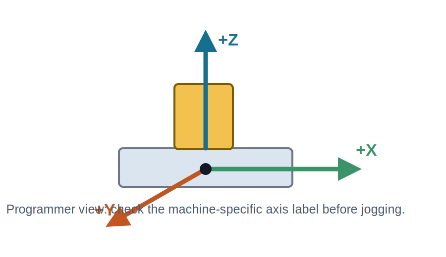
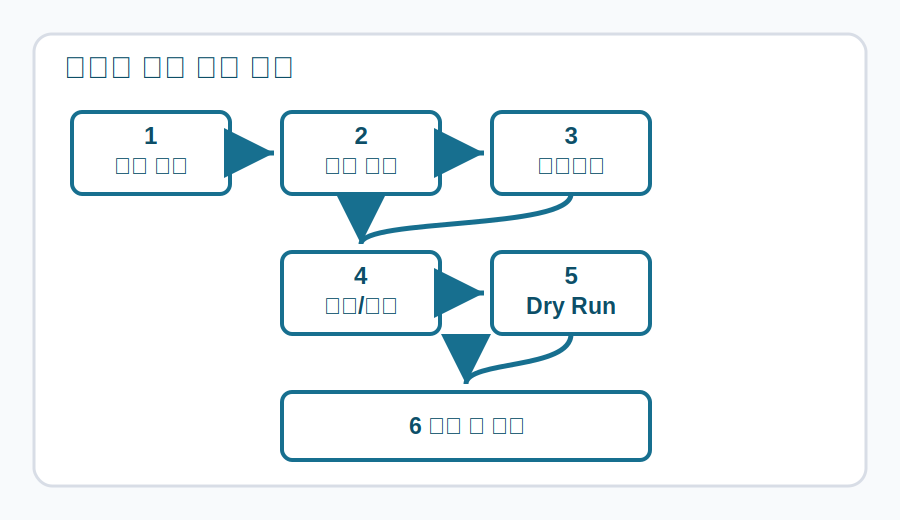
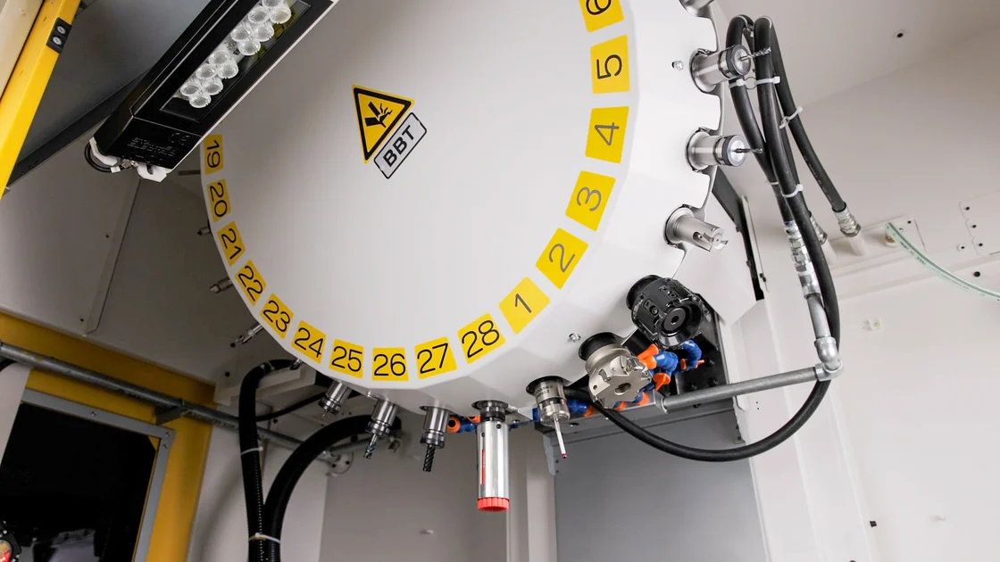

<section class="cover">

<h1>FANUC ROBODRILL 초보자 교육 매뉴얼</h1>

Level 1 - Item 01 장비 이해, 안전 점검, 기본 조작 흐름

<strong>대상</strong>ROBODRILL을 처음 다루는 생산, 품질, 설비, 공정 담당자
<strong>목표</strong>작업 전 안전 확인부터 기준점 복귀, 수동 이송, 기본 점검 기록까지 독립적으로 설명하고 수행한다.
<strong>형식</strong>이론 설명, 도해, 표, 현장 실습, 확인 문제

</section>

[PAGE_BREAK]

# 1. 학습 목표와 사용 범위

이 항목은 FANUC ROBODRILL을 처음 접하는 학습자가 장비를 안전하게 이해하고, 실제 가공 전 준비 동작을 순서대로 설명할 수 있도록 구성한 기초 교재이다. 특정 공장의 세부 작업표준서나 설비 옵션은 현장마다 다를 수 있으므로, 본 교재는 공통적인 초급 교육 뼈대를 제공한다.

학습자는 이 단원을 마친 뒤 다음 행동을 할 수 있어야 한다.

- ROBODRILL의 주요 구성 요소를 이름과 기능으로 구분한다.
- 비상정지, 문 인터록, 주축, 공구 교환 장치, 작업 테이블의 위험 요소를 설명한다.
- 전원 투입 전 점검 항목을 표준 체크리스트에 따라 확인한다.
- 기계 좌표계와 작업 좌표계의 차이를 말로 설명한다.
- 급속 이송, 조그 이송, 핸들 이송을 상황에 맞게 선택한다.
- 가공 프로그램 실행 전 드라이런과 싱글블록 확인이 필요한 이유를 설명한다.
- 실습 결과를 기록하고 이상 징후를 보고한다.

> 안전 주의: 본 교재는 교육용 자료이며, 실제 장비 조작은 반드시 현장 안전 규정, 장비 제조사 매뉴얼, 사내 작업표준서, 지도 강사의 지시에 따른다.

## 초보자 교육에서 가장 중요한 관점

초보자는 버튼 이름을 외우기보다 "기계가 어떤 상태인지 확인한 다음, 다음 동작이 안전한지 판단한다"는 흐름을 먼저 익혀야 한다. 같은 버튼이라도 모드, 문 상태, 오버라이드, 프로그램 상태에 따라 결과가 달라질 수 있다. 따라서 모든 조작은 확인, 선택, 실행, 관찰, 기록의 순서로 진행한다.

| 구분 | 초보자가 흔히 놓치는 점 | 교육 중 강조할 내용 |
| --- | --- | --- |
| 안전 | 비상정지만 알면 충분하다고 생각함 | 위험을 만들기 전에 멈추는 절차를 익힌다 |
| 좌표 | X, Y, Z 방향을 화면 숫자로만 이해함 | 실제 테이블과 주축 움직임으로 연결한다 |
| 이송 | 빠른 이동과 느린 이동의 차이를 과소평가함 | 첫 접근은 낮은 속도와 충분한 거리에서 한다 |
| 프로그램 | 시작 버튼을 누르면 곧바로 가공된다고 생각함 | 드라이런, 싱글블록, 오버라이드 확인을 습관화한다 |

# 2. 장비 구성 이해

ROBODRILL은 소형 고속 머시닝센터 계열 장비로, 드릴링, 탭핑, 밀링 등 다양한 가공에 사용된다. 초급 단계에서는 장비의 정밀 구조보다 조작자가 반드시 관찰해야 하는 구성 요소를 먼저 구분한다.

그림 1. 실제 ROBODRILL 설비 예시. 사진: Mixabest, Wikimedia Commons, CC BY-SA 3.0.

## 주요 구성 요소

| 구성 요소 | 역할 | 초급 점검 포인트 |
| --- | --- | --- |
| 작업 영역 | 소재, 바이스, 지그, 공구가 실제로 움직이는 공간 | 문이 닫혔는지, 내부에 공구나 렌치가 남아 있지 않은지 확인 |
| 주축 | 공구를 회전시켜 가공을 수행 | 회전 전 간섭물, 공구 장착 상태, 회전 방향 확인 |
| 테이블 | 소재와 지그를 고정하고 X/Y 방향 위치를 만든다 | 클램프 체결, 지그 위치, 칩 쌓임 확인 |
| ATC | 공구를 자동 교환 | 공구 번호와 매거진 위치가 맞는지 확인 |
| CNC 패널 | 모드 선택, 수동 이송, 프로그램 실행, 알람 확인 | 현재 모드와 오버라이드 값을 먼저 읽는다 |
| 윤활/에어/절삭유 계통 | 장비 동작을 보조하고 가공 품질을 안정화 | 압력, 잔량, 누유, 막힘 확인 |

## 첫 관찰 순서

1. 장비 주변 바닥에 절삭유, 칩, 공구, 케이블이 방치되어 있지 않은지 본다.
2. 기계 정면에서 도어, 패널, 비상정지 버튼 위치를 확인한다.
3. 작업 영역 안쪽에 고정되지 않은 물건이 없는지 확인한다.
4. 공구 매거진과 주축에 장착된 공구가 작업지시서와 맞는지 확인한다.
5. 화면에 알람, 메시지, 미완료 프로그램 상태가 있는지 확인한다.

> 안전 주의: 문이 열린 상태에서 내부를 확인할 때도 손을 주축, 공구, 자동문, ATC 동작 범위 안에 넣지 않는다. "멈춰 있는 것처럼 보이는 상태"와 "동작할 수 없는 상태"는 다르다.

# 3. 작업 전 안전 점검

기초 교육에서 안전 점검은 별도 절차가 아니라 모든 조작의 시작점이다. 장비가 정상처럼 보여도 압축공기, 윤활, 도어 인터록, 공구 체결 중 하나라도 불안정하면 작은 실수가 큰 충돌로 이어질 수 있다.

## 3분 사전 점검표

| 순서 | 확인 항목 | 정상 기준 | 이상 시 조치 |
| --- | --- | --- | --- |
| 1 | 주변 정리 | 통로가 막히지 않고 미끄럼 위험이 없다 | 작업 전 청소, 장애물 제거 |
| 2 | 비상정지 | 버튼 위치를 알고 눌림 상태가 아니다 | 원인 확인 후 지도자에게 보고 |
| 3 | 도어 | 닫힘 상태와 인터록 상태가 정상이다 | 강제 우회 금지, 알람 확인 |
| 4 | 에어 압력 | 현장 기준 범위 안에 있다 | 공급 밸브와 압력계 확인 |
| 5 | 절삭유 | 잔량과 분사 방향이 작업에 적합하다 | 보충 또는 노즐 조정 요청 |
| 6 | 공구 | 번호, 길이, 파손 여부가 확인된다 | 공구 교체 또는 보정 확인 |
| 7 | 소재 고정 | 바이스, 클램프, 지그가 단단히 고정된다 | 재고정 후 다시 확인 |
| 8 | 화면 상태 | 알람과 비정상 메시지가 없다 | 알람 번호 기록 후 보고 |

## 비상정지의 역할과 한계

비상정지는 위험이 이미 발생했거나 즉시 멈춰야 할 때 사용하는 마지막 방어 수단이다. 그러나 비상정지는 충돌을 "없던 일"로 만들지 않는다. 주축 회전 관성, 축 감속 거리, 공구와 소재의 접촉 상태 때문에 이미 손상된 부품이 생길 수 있다. 따라서 초보자는 비상정지를 배우는 동시에 비상정지를 누를 상황을 만들지 않는 예방 절차를 더 중요하게 배워야 한다.

## 작업자 보호구

- 보안경은 칩 비산과 절삭유 튐을 막기 위한 기본 보호구이다.
- 장갑은 회전 부품 근처에서 말려 들어갈 수 있으므로 현장 규정에 따른다.
- 긴 머리, 끈, 목걸이, 느슨한 소매는 회전부 근처에서 위험하다.
- 청소용 에어건 사용 시 칩이 반사되어 눈이나 피부에 닿을 수 있다.

실습 1: 장비 앞에서 비상정지 버튼, 도어 인터록, 압력계, 절삭유 탱크 확인 위치를 손으로 가리키고 이름을 말한다. 실제 버튼을 누르기 전에는 반드시 지도자의 지시를 받는다.

# 4. 좌표계와 축 방향

초급자가 가장 많이 혼동하는 영역은 좌표계이다. 화면의 숫자는 추상적인 값이지만, 실제 장비에서는 공구, 테이블, 소재의 상대 위치로 나타난다. 좌표를 이해하지 못한 상태에서 축을 이동하면 공구가 지그나 소재에 접근하는 방향을 놓치기 쉽다.

그림 2. 수직형 머시닝센터 기준의 기본 축 개념도. 실제 +Y 방향 표시는 장비 표기와 교육장 기준을 따른다.

## 기계 좌표와 작업 좌표

기계 좌표는 장비가 스스로 알고 있는 기준 위치이다. 기준점 복귀를 통해 장비는 각 축의 원점을 다시 확인한다. 작업 좌표는 현재 소재와 작업 기준에 맞춰 설정하는 좌표이다. 예를 들어 같은 장비라도 소재를 바이스 왼쪽에 물릴 때와 오른쪽에 물릴 때 작업 원점은 달라질 수 있다.

| 좌표 종류 | 의미 | 초급자가 기억할 문장 |
| --- | --- | --- |
| 기계 좌표 | 장비 자체의 기준 위치 | 기계가 자기 위치를 아는 기준 |
| 작업 좌표 | 소재 가공 기준 위치 | 작업자가 이 소재의 0점을 정한 기준 |
| 상대 좌표 | 임시 확인용 위치 차이 | 지금 움직인 양을 보기 위한 보조 값 |
| 공구 길이 보정 | 공구 끝 위치를 맞추는 보정 | 공구마다 길이가 다르다는 사실을 반영 |

## 축 이동 전 5초 확인

1. 현재 모드가 수동 조작에 맞는지 확인한다.
2. 움직일 축이 X, Y, Z 중 무엇인지 말로 확인한다.
3. + 방향과 - 방향 중 어느 쪽으로 움직일지 손가락으로 예상한다.
4. 공구 끝과 소재, 지그, 테이블의 거리를 눈으로 확인한다.
5. 오버라이드가 낮은 값인지 확인하고 짧게 움직인다.

> 안전 주의: Z축은 공구와 소재가 직접 충돌하기 쉬운 축이다. 처음 접근할 때는 빠른 이송을 피하고, 충분한 거리에서 단계적으로 접근한다.

# 5. 패널과 운전 모드 기본

FANUC 계열 CNC 패널은 장비 상태를 표시하고 조작자가 모드를 선택하는 중심 장치이다. 실제 버튼 이름과 배치는 모델, 옵션, 패널 언어에 따라 달라질 수 있지만, 초급 교육에서는 "지금 어떤 모드인가"와 "이 버튼을 누르면 무엇이 움직이는가"를 먼저 확인한다.

그림 3. ROBODRILL Plus CNC 패널 참고 이미지. 출처: FANUC America ROBODRILL 제품 페이지. 공식 이미지는 사용권 확인 후 배포한다.

## 자주 만나는 운전 모드

| 모드 | 사용 목적 | 초급 주의점 |
| --- | --- | --- |
| EDIT | 프로그램 작성 또는 수정 | 실제 가공 실행 모드가 아니지만 잘못 수정하면 품질 문제가 생긴다 |
| MEM/AUTO | 저장된 프로그램 자동 실행 | 실행 전 드라이런, 싱글블록, 오버라이드 확인 |
| MDI | 짧은 명령을 직접 입력해 실행 | 명령 한 줄도 실제 장비를 움직일 수 있다 |
| JOG | 버튼으로 축을 수동 이동 | 축 선택과 방향을 반드시 확인 |
| HANDLE | 핸들로 미세 이동 | 배율 선택을 잘못하면 예상보다 많이 움직인다 |
| REF/ZRN | 기준점 복귀 | 축 순서와 주변 간섭을 확인 |

## 오버라이드의 의미

오버라이드는 프로그램이나 수동 조작의 속도를 제한하거나 조정하는 장치이다. 초보자는 오버라이드를 "느리게 만드는 다이얼" 정도로 이해하기 쉽지만, 실제로는 안전 확인과 가공 조건 검증에 매우 중요하다. 첫 실행에서는 급속 이송 오버라이드와 피드 오버라이드를 낮게 두고 기계 반응을 관찰한다.

## 화면에서 먼저 볼 정보

- 현재 모드
- 현재 실행 중인 프로그램 번호
- 알람 또는 메시지
- 기계 좌표와 작업 좌표
- 주축 회전 상태
- 이송 속도와 오버라이드
- 선택된 공구 번호

실습 2: 지도자가 지정한 화면에서 현재 모드, 프로그램 번호, 주축 상태, 공구 번호, 오버라이드 값을 읽어 교육 기록지에 적는다. 버튼을 누르기 전에 화면 정보를 먼저 말하는 습관을 만든다.

# 6. 전원 투입과 기준점 복귀

전원을 켜는 행위는 단순히 기계를 켜는 것이 아니라, 장비가 안전하게 자기 상태를 다시 확인하도록 준비하는 과정이다. 초급자는 전원 투입 직후 바로 축을 움직이려 하기보다 화면 메시지, 압력 상태, 알람 상태를 먼저 확인해야 한다.

## 권장 흐름

그림 4. 초급 교육용 기본 흐름. 현장 표준 절차가 있으면 현장 절차를 우선한다.

## 기준점 복귀 절차의 의미

기준점 복귀는 장비가 각 축의 기준 위치를 확인하는 과정이다. 이 과정이 끝나야 기계 좌표가 신뢰 가능한 상태가 된다. 기준점 복귀가 불완전하면 이후 작업 좌표, 공구 교환 위치, 프로그램 이동 위치가 모두 불안정해질 수 있다.

| 단계 | 행동 | 확인 |
| --- | --- | --- |
| 1 | 주 전원과 CNC 전원 상태 확인 | 화면 부팅 완료 |
| 2 | 비상정지 해제 여부 확인 | 해제 전 원인 확인 |
| 3 | 에어 압력과 윤활 상태 확인 | 알람 없음 |
| 4 | REF/ZRN 모드 선택 | 주변 간섭 없음 |
| 5 | 축별 기준점 복귀 | 화면의 복귀 완료 표시 확인 |
| 6 | 이상 소음과 진동 확인 | 이상 시 즉시 정지 후 보고 |

> 안전 주의: 기준점 복귀 중에도 축은 실제로 움직인다. 작업 영역에 공구, 측정기, 렌치, 손이 들어가 있지 않은지 확인한다.

# 7. 수동 이송과 접근 거리

수동 이송은 초보자가 장비 움직임을 직접 체감하는 첫 단계이다. 동시에 충돌 위험이 가장 빠르게 드러나는 단계이기도 하다. 교육에서는 한 번에 많이 이동하는 것보다 짧게 움직이고 멈춰서 확인하는 습관을 만든다.

## 조그 이송과 핸들 이송

조그 이송은 버튼을 누르는 동안 축이 움직이는 방식이다. 빠르게 위치를 이동할 때 편리하지만 방향을 잘못 선택하면 위험하다. 핸들 이송은 손잡이를 돌려 미세하게 움직이는 방식이며, 소재 접근, 터치 확인, 지그 주변 이동에 적합하다.

| 상황 | 권장 방식 | 이유 |
| --- | --- | --- |
| 넓은 빈 공간에서 대략 위치 이동 | JOG, 낮은 오버라이드 | 빠르게 이동하되 반응을 관찰 |
| 공구가 소재에 가까워지는 구간 | HANDLE, 낮은 배율 | 작은 이동량으로 간섭 방지 |
| Z축 하강 접근 | HANDLE 우선 | 충돌 가능성이 높기 때문 |
| 프로그램 첫 실행 전 위치 확인 | JOG 또는 HANDLE | 실제 동작 범위를 눈으로 확인 |

## 접근 거리 규칙

초급 교육에서는 수치보다 습관이 중요하다. 공구와 소재가 충분히 떨어져 있을 때는 큰 이동이 가능하지만, 가까워질수록 이동량과 속도를 줄인다. 특히 공구 끝이 소재 상면, 바이스 턱, 클램프 근처로 접근하는 경우에는 핸들 배율을 낮추고 한 칸씩 움직인다.

1. 처음에는 멀리서 움직임 방향만 확인한다.
2. 접근 중간에 멈추고 공구 끝 위치를 눈으로 확인한다.
3. 마지막 접근은 낮은 배율의 핸들 이송으로 진행한다.
4. 확신이 없으면 멈추고 지도자에게 확인을 요청한다.

실습 3: 공구가 소재와 충분히 떨어진 교육 위치에서 X축 + 방향, X축 - 방향, Y축 + 방향, Y축 - 방향을 각각 짧게 움직인다. 각 이동 후 실제 움직임을 말로 설명한다.

# 8. 공구와 소재 고정 확인

가공 품질과 안전은 공구와 소재 고정에서 시작한다. 초보자는 프로그램이나 CNC 화면에 집중하다가 실제 공구와 소재가 어떻게 잡혀 있는지 확인을 놓칠 수 있다. 그러나 잘못 고정된 소재는 낮은 절삭 조건에서도 움직일 수 있고, 파손된 공구는 기준 위치가 맞아도 불량을 만든다.

그림 5. ROBODRILL 공구교환기 참고 이미지. 출처: FANUC America ROBODRILL 제품 페이지. 공식 이미지는 사용권 확인 후 배포한다.

## 공구 확인 항목

- 공구 번호가 작업지시서와 맞는가
- 공구 홀더가 깨끗하고 칩이 끼어 있지 않은가
- 절삭날에 깨짐, 마모, 이물질이 없는가
- 공구 길이 보정 값이 최신 상태인가
- 주축에 장착된 공구와 화면의 공구 번호가 일치하는가

## 소재와 지그 확인 항목

| 항목 | 확인 방법 | 이상 예 |
| --- | --- | --- |
| 소재 방향 | 기준면, 마킹, 도면 방향 확인 | 좌우 반전, 앞뒤 반전 |
| 클램프 | 손으로 흔들림 여부 확인 | 약한 체결, 한쪽만 물림 |
| 지그 기준면 | 칩 제거 후 밀착 확인 | 칩 끼임, 들뜸 |
| 바이스 | 조임 상태와 평행 확인 | 턱 사이 이물질, 편심 |
| 간섭 | 공구 이동 경로 상 장애물 확인 | 클램프 볼트가 공구 경로에 있음 |

## 초급자에게 유용한 질문

작업 전 스스로에게 다음 질문을 던진다.

1. 이 공구가 회전하면 가장 먼저 닿을 수 있는 물체는 무엇인가?
2. 소재가 힘을 받으면 어느 방향으로 밀릴 수 있는가?
3. 절삭유 노즐은 공구 끝을 향하고 있는가?
4. 현재 공구 번호와 프로그램의 T 번호가 일치하는가?
5. 작업을 멈춰야 할 경우 가장 가까운 정지 수단은 무엇인가?

# 9. 프로그램 실행 전 확인

자동 운전은 초보자에게 가장 긴장되는 단계이다. 프로그램 시작 버튼을 누르기 전에는 기계가 어떤 경로로 움직일지, 첫 공구가 무엇인지, 첫 접근 높이가 안전한지 확인해야 한다. 첫 실행에서는 가공 속도보다 관찰 가능성이 더 중요하다.

## 첫 실행 전 체크리스트

| 확인 항목 | 질문 | 권장 조치 |
| --- | --- | --- |
| 프로그램 번호 | 실행할 프로그램이 맞는가 | 작업지시서와 화면 번호 대조 |
| 작업 좌표 | G54 등 좌표계가 맞는가 | 세팅 기록과 화면 확인 |
| 공구 보정 | 길이와 반경 보정이 맞는가 | 공구표와 보정 화면 확인 |
| 오버라이드 | 처음부터 빠르지 않은가 | 낮은 값으로 시작 |
| 드라이런 | 공구 경로를 확인했는가 | 소재 위 충분한 높이에서 확인 |
| 싱글블록 | 한 블록씩 볼 준비가 되었는가 | 위험 구간에서 사용 |
| 절삭유 | 필요한 조건에서 분사되는가 | 노즐 방향과 잔량 확인 |

## 드라이런의 목적

드라이런은 "가공하지 않는 실행"이 아니라 "위험을 낮추고 경로를 확인하는 실행"이다. 공구가 실제 소재를 절삭하지 않더라도 축은 움직이고 공구 교환도 발생할 수 있다. 따라서 드라이런 중에도 작업자는 화면과 작업 영역을 동시에 관찰해야 한다.

## 싱글블록의 목적

싱글블록은 프로그램을 한 줄씩 실행해 각 동작을 확인하는 기능이다. 초급 교육에서는 공구 접근, 좌표 이동, 주축 회전, 절삭유 켜짐, 공구 교환 직후 등 위험이 커지는 구간에서 싱글블록을 활용한다.

> 안전 주의: 드라이런과 싱글블록을 켰다고 해서 충돌이 자동으로 방지되는 것은 아니다. 오버라이드, 좌표, 공구 길이, 소재 고정이 틀리면 여전히 충돌할 수 있다.

# 10. 교육 실습 시나리오

이 실습은 실제 절삭을 하지 않고 기본 조작 흐름을 익히는 것을 목표로 한다. 지도자는 장비 상태와 현장 규정을 확인한 뒤 교육용 위치와 안전 조건을 지정한다.

## 실습 A: 장비 상태 읽기

1. 장비 정면에서 비상정지 버튼과 도어 위치를 확인한다.
2. 화면에서 현재 모드와 알람 상태를 읽는다.
3. 작업 영역 안쪽의 공구, 소재, 지그 상태를 관찰한다.
4. 오버라이드 값을 확인하고 기록한다.
5. 지도자에게 "현재 장비 상태"를 한 문장으로 보고한다.

예시 보고: "현재 장비는 수동 모드이며 알람은 없고, 작업 영역에는 교육용 지그만 고정되어 있으며 오버라이드는 낮은 값입니다."

## 실습 B: 축 방향 확인

1. 지도자가 지정한 안전 위치에서 JOG 모드를 선택한다.
2. X축을 짧게 + 방향으로 움직이고 실제 움직임을 관찰한다.
3. X축을 원래 위치 근처로 되돌린다.
4. Y축과 Z축도 같은 방식으로 짧게 확인한다.
5. Z축은 소재와 충분히 떨어진 위치에서만 진행한다.

## 실습 C: 실행 전 점검 말하기

프로그램을 실제 실행하지 않고, 시작 버튼을 누르기 전 확인할 항목을 순서대로 말한다. 학습자는 최소한 프로그램 번호, 좌표계, 공구 번호, 오버라이드, 도어 상태, 드라이런 여부를 포함해야 한다.

기록 과제: 실습 A-C를 마친 뒤 가장 헷갈렸던 축 방향, 가장 중요하다고 느낀 안전 확인, 추가로 질문할 내용을 교육 기록지에 적는다.

# 11. 흔한 실수와 예방 방법

초보 교육의 목적은 실수를 탓하는 것이 아니라 실수가 발생하기 쉬운 조건을 미리 알아차리는 것이다. 아래 항목은 현장에서 반복적으로 나타나는 실수 유형을 교육용으로 정리한 것이다.

| 실수 유형 | 발생 원인 | 예방 질문 |
| --- | --- | --- |
| 잘못된 축 이동 | 축 선택과 방향 확인 없이 버튼 조작 | "내가 움직일 축과 방향을 말했는가?" |
| 빠른 접근 | 오버라이드와 거리 감각 부족 | "공구가 가까워졌는데 속도를 낮췄는가?" |
| 좌표 혼동 | 기계 좌표와 작업 좌표를 구분하지 못함 | "지금 보는 숫자는 어떤 좌표인가?" |
| 공구 번호 불일치 | 화면, 매거진, 작업지시서 미대조 | "T 번호와 실제 공구가 같은가?" |
| 소재 고정 부족 | 클램프 확인 생략 | "손으로 흔들림을 확인했는가?" |
| 알람 무시 | 메시지를 읽지 않고 재시작 | "알람 번호와 내용을 기록했는가?" |

## 멈추는 것도 조작이다

초보자는 무언가 진행해야 한다는 압박 때문에 이상 징후를 보고도 계속 조작하려는 경우가 있다. 그러나 설비 교육에서 멈추는 행동은 실패가 아니라 정상적인 판단이다. 소리, 진동, 냄새, 예상과 다른 방향 이동, 화면 알람, 절삭유 이상이 보이면 즉시 멈추고 상태를 기록한다.

## 보고의 기본 형식

이상 상황을 보고할 때는 감상보다 사실을 먼저 말한다.

1. 언제 발생했는가
2. 어떤 모드였는가
3. 어떤 버튼 또는 동작 직후였는가
4. 화면에 어떤 알람이나 메시지가 있었는가
5. 기계가 실제로 어떻게 움직였는가

# 12. 확인 문제

다음 문제는 학습자가 Level 1 - Item 01의 핵심 내용을 이해했는지 확인하기 위한 것이다. 실제 현장 평가에서는 지도자가 장비 앞 구두 질문과 함께 확인한다.

## 객관식

1. 기준점 복귀의 가장 알맞은 설명은 무엇인가?
   - A. 공구를 자동으로 교체하는 절차
   - B. 장비가 각 축의 기준 위치를 확인하는 절차
   - C. 절삭유를 자동으로 보충하는 절차
   - D. 프로그램을 삭제하는 절차

2. 첫 프로그램 실행 전 권장되는 행동이 아닌 것은 무엇인가?
   - A. 프로그램 번호 확인
   - B. 오버라이드 낮춤
   - C. 드라이런 또는 싱글블록 검토
   - D. 도어 인터록 강제 우회

3. Z축 접근 시 특히 주의해야 하는 이유는 무엇인가?
   - A. 화면 글자가 작기 때문
   - B. 공구와 소재가 직접 충돌하기 쉽기 때문
   - C. 절삭유 색이 바뀌기 때문
   - D. 프로그램 번호가 바뀌기 때문

## 단답형

1. 작업 전 안전 점검에서 확인할 항목을 5가지 쓰시오.
2. 기계 좌표와 작업 좌표의 차이를 한 문장으로 설명하시오.
3. 드라이런을 수행하는 목적을 설명하시오.
4. 이상 소음이나 예상과 다른 움직임을 발견했을 때 첫 행동은 무엇인가?

## 실습 평가 체크

| 평가 항목 | 통과 기준 | 결과 |
| --- | --- | --- |
| 비상정지 위치 설명 | 버튼 위치와 사용 상황을 말할 수 있다 | |
| 화면 상태 읽기 | 모드, 알람, 오버라이드 중 3개 이상을 읽는다 | |
| 축 방향 확인 | X/Y/Z 이동 방향을 실제 움직임과 연결한다 | |
| 접근 속도 관리 | 공구 접근 시 낮은 속도와 짧은 이동을 사용한다 | |
| 실행 전 보고 | 프로그램 실행 전 확인 항목을 순서대로 말한다 | |

# 13. 정답과 지도자 메모

## 객관식 정답

1. B
2. D
3. B

## 단답형 예시

1. 주변 정리, 비상정지 상태, 도어 인터록, 에어 압력, 절삭유 잔량, 공구 상태, 소재 고정, 화면 알람 상태 중 5가지.
2. 기계 좌표는 장비 자체 기준 위치이고, 작업 좌표는 현재 소재 가공을 위해 작업자가 설정한 기준 위치이다.
3. 프로그램 실행 전 공구 경로와 장비 움직임을 낮은 위험 상태에서 확인하기 위해 수행한다.
4. 즉시 멈추고 화면 상태와 발생 조건을 확인한 뒤 지도자 또는 책임자에게 보고한다.

## 지도자 메모

초급 교육에서는 학습자가 빠르게 조작하는 것보다 안전하게 멈추고 설명하는 능력을 우선 평가한다. 장비 앞에서 학습자가 버튼을 누르기 전, 어떤 상태를 확인했는지 말하게 하면 사고 예방 습관을 만들 수 있다. 특히 축 방향, 오버라이드, Z축 접근, 작업 좌표는 반복 질문을 통해 몸에 익히도록 한다.

## 다음 항목으로 넘어가기 전 확인

- 학습자가 작업 전 점검표를 보고 없이 설명할 수 있는가
- 비상정지와 일반 정지의 차이를 설명할 수 있는가
- JOG와 HANDLE의 차이를 말하고 안전하게 선택할 수 있는가
- 기준점 복귀가 왜 필요한지 설명할 수 있는가
- 드라이런과 싱글블록의 목적을 이해했는가

위 항목이 충족되면 Level 1 - Item 02에서 공구 번호, 기본 프로그램 구조, 좌표계 세팅 기록지 작성으로 확장한다.
