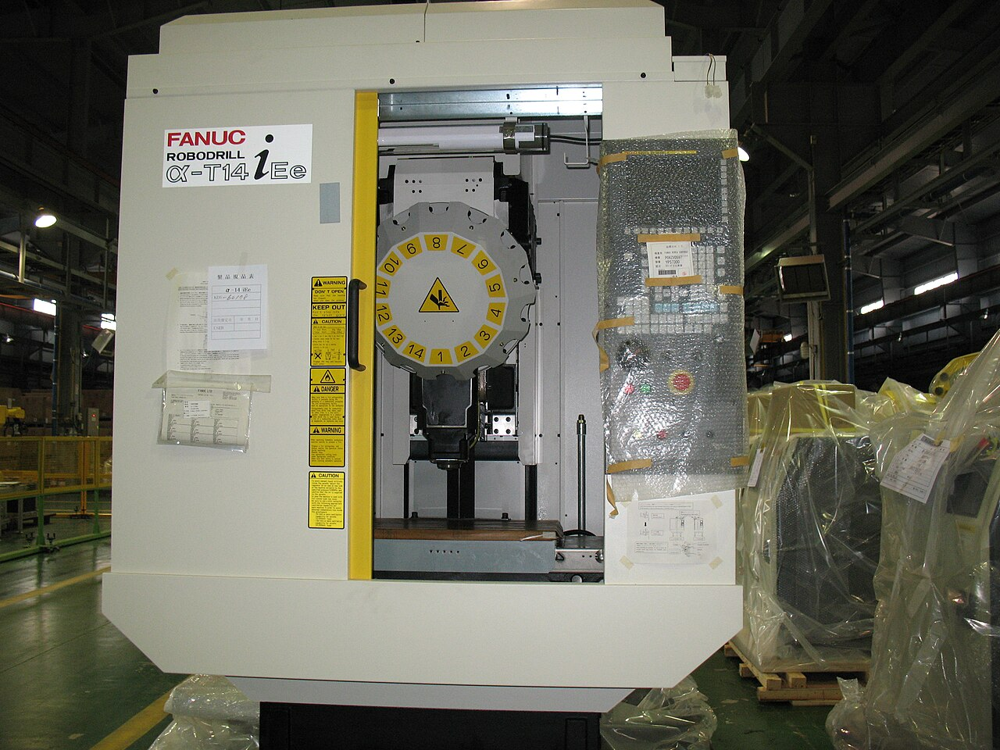
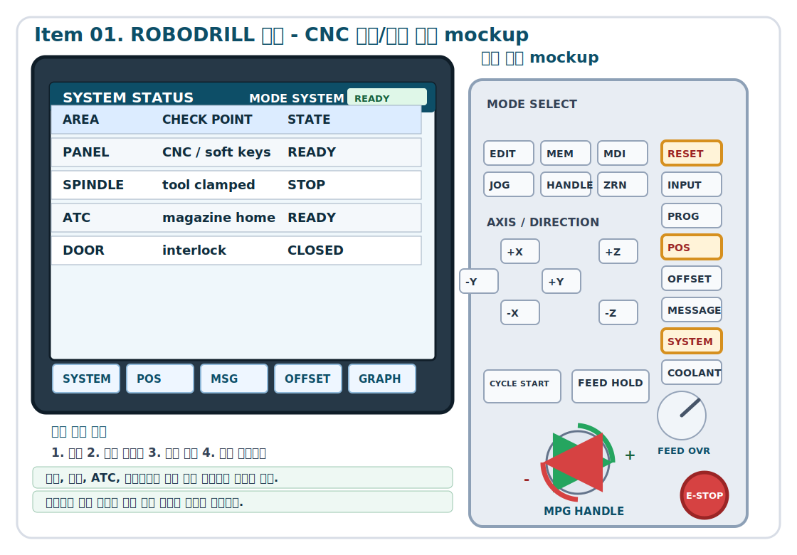
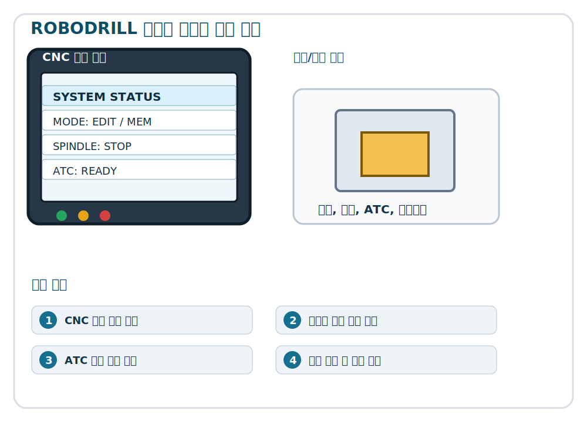

<section class="cover">

<h1>Giáo trình cơ bản FANUC ROBODRILL</h1>

Level 1 - Item 01 Cấu trúc ROBODRILL

<strong>Đối tượng</strong>Người vận hành mới, nhân viên chất lượng và nhân viên bảo trì thiết bị
<strong>Mục tiêu</strong>Phân biệt thân máy, vùng làm việc, trục chính, ATC và bảng điều khiển CNC.
<strong>Hình thức</strong>Mục tiêu, an toàn, hình ảnh thực tế, quy trình, thực hành, câu hỏi kiểm tra

</section>

[PAGE_BREAK]

# 01. Cấu trúc ROBODRILL

Mục này giúp học viên mới hiểu và giải thích an toàn nội dung Cấu trúc ROBODRILL. Phân biệt thân máy, vùng làm việc, trục chính, ATC và bảng điều khiển CNC. Người vận hành không chỉ học tên nút mà phải đọc trạng thái máy, dự đoán hành động tiếp theo và nhận biết vị trí nguy hiểm trước khi thao tác. Mọi thao tác được thực hiện theo thứ tự kiểm tra, chọn, thực hiện, quan sát và ghi lại.

> Chú ý an toàn: Khi thao tác trên máy thật, luôn tuân thủ quy định an toàn tại xưởng, tài liệu của nhà sản xuất, tiêu chuẩn công việc nội bộ và hướng dẫn của giảng viên. Nếu chưa chắc chắn, hãy dừng lại và báo cáo trạng thái.

## Mục tiêu đào tạo

- Phân biệt thân máy, vùng làm việc, trục chính, ATC và bảng điều khiển CNC.
- Giải thích được nút liên quan, thông tin trên màn hình và phản ứng của máy.
- Kiểm tra các hạng mục an toàn trước thao tác bằng checklist.
- Phân biệt trạng thái bình thường và bất thường để báo cáo cho giảng viên.
- Ghi lại kết quả thực hành vào phiếu công việc.

| Nhóm | Hành động học viên cần làm | Tiêu chuẩn đạt |
| --- | --- | --- |
| Hiểu | Giải thích mục đích của Cấu trúc ROBODRILL | Dùng ít nhất 3 thuật ngữ chính |
| Kiểm tra | Tìm yếu tố nguy hiểm trước thao tác | Kiểm tra vùng làm việc, màn hình và override |
| Thực hiện | Làm từng bước dưới sự giám sát | Không thao tác nhanh, luôn dừng để xác nhận |
| Ghi nhận | Ghi kết quả và bất thường | Có ngày, trạng thái máy và người xác nhận |

[PAGE_BREAK]

## An toàn

Thời điểm nguy hiểm nhất trong Cấu trúc ROBODRILL là khi người vận hành chạy bước tiếp theo mà chưa đọc trạng thái máy. Trục chính, chuyển động trục, thay dao, nhập tọa độ và chạy chương trình đều có thể biến thao tác trên màn hình thành chuyển động thật. Học viên phải nhìn đồng thời số trên màn hình và vị trí dao thật.

Trước khi thao tác, học viên đọc sơ đồ học của bài này và liên hệ giữa trạng thái trên màn hình với bộ phận có thể chuyển động trên máy thật. Nếu chưa giải thích được sơ đồ, không bắt đầu thao tác.

| Tình huống nguy hiểm | Nguyên nhân | Cách phòng tránh |
| --- | --- | --- |
| Trục đi sai hướng | Nhầm trục, hướng hoặc hệ tọa độ | Nói rõ trục và hướng trước khi chạy |
| Va chạm | Không nhìn khoảng cách dao, phôi, đồ gá | Tiếp cận bằng tốc độ thấp và bước ngắn |
| Khởi động lại sai | Không kiểm tra nguyên nhân alarm | Ghi mã alarm và điều kiện phát sinh |
| Lỗi chất lượng | Bỏ sót giá trị bù hoặc mặt chuẩn | Đối chiếu phiếu ghi và màn hình |

> Chú ý an toàn: Emergency stop là lớp bảo vệ cuối cùng. Trước khi cần dùng nó, hãy giảm override, dừng lại và xác nhận khi có nghi ngờ.

[PAGE_BREAK]

## Hình ảnh thực tế và điểm quan sát

Hình 1-1. Hình tham khảo cho bài Cấu trúc ROBODRILL. Nguồn và quyền sử dụng được ghi trong tài liệu nguồn hình ảnh.

Khi quan sát hình, không nên nhìn toàn bộ máy một cách chung chung. Hãy bắt đầu từ vị trí ảnh hưởng trực tiếp đến người vận hành. Thứ nhất, tìm vùng nguy hiểm nơi tay hoặc cơ thể có thể đi vào. Thứ hai, liên hệ nút hoặc màn hình với cơ cấu sẽ chuyển động. Thứ ba, xác định vị trí có thể dừng máy ngay khi có bất thường.

Hình 1-2. Mockup màn hình CNC và bảng điều khiển cần đọc trong bài Cấu trúc ROBODRILL.

Mockup này dùng để luyện cách đọc mode, trạng thái, tọa độ, chương trình, offset hoặc alarm trước khi thao tác trên máy thật. Phần bảng điều khiển bên phải đánh dấu nút hoặc núm xoay cần kiểm tra trong bài học. Bố cục trên máy thật có thể khác theo tùy chọn và phiên bản, nên khi học phải tìm vị trí có cùng ý nghĩa trên máy tại xưởng.

Hình 1-3. Sơ đồ học cho Cấu trúc ROBODRILL, gồm thứ tự thao tác và chuyển động thật.

Sơ đồ này không phải hình trang trí. Trước khi thực hành, học viên đọc màn hình CNC ở bên trái để biết mode, trục, số chương trình hoặc giá trị offset, sau đó nhìn phần chuyển động bên phải để hiểu cơ cấu nào sẽ di chuyển. Các bước bên dưới được dùng để báo cáo miệng với giảng viên rồi mới thao tác từng bước.

## Khái niệm cốt lõi

Điểm cốt lõi của Cấu trúc ROBODRILL không chỉ là nhớ quy trình, mà là hiểu vì sao quy trình đó tồn tại. ROBODRILL là máy nhỏ và nhanh, nên một lần bỏ sót kiểm tra cũng có thể dẫn tới va chạm hoặc lỗi chất lượng. Vì vậy ở cấp cơ bản, thói quen quan sát an toàn quan trọng hơn tốc độ thao tác.

Học viên chỉ vào sơ đồ chức năng để giải thích ví dụ màn hình, hướng chuyển động và thứ tự học. Các số, mode hoặc tên nút trên sơ đồ phải được kiểm tra lại trên màn hình máy thật.

| Thuật ngữ | Ý nghĩa | Kiểm tra tại hiện trường |
| --- | --- | --- |
| Kiểm tra trạng thái | Đọc máy đang ở mode và điều kiện nào | Màn hình, đèn, alarm, override |
| Điều kiện chạy | Trạng thái máy có thể chuyển động | Cửa, Servo, tọa độ, dao |
| Khoảng cách quan sát | Khoảng hở giữa dao và phôi | Càng gần càng giảm tốc độ và lượng di chuyển |
| Ghi nhận | Bằng chứng để người sau hiểu | Giá trị, alarm, xử lý, người xác nhận |

[PAGE_BREAK]

## Quy trình từng bước

Quy trình sau là luồng đào tạo cơ bản. Nếu xưởng có quy trình riêng, phải ưu tiên quy trình của xưởng.

Trước khi bắt đầu quy trình, học viên đọc thứ tự trên sơ đồ và tìm cùng tên nút hoặc hiển thị trên bảng điều khiển thật. Nếu tên hoặc trạng thái màn hình khác, phải hỏi giảng viên trước.

1. Kiểm tra khu vực xung quanh, bảo hộ và vị trí emergency stop.
2. Đọc mode hiện tại, alarm và trạng thái chương trình trên màn hình CNC.
3. Kiểm tra dao, phôi, đồ gá và phoi trong vùng làm việc.
4. Tìm nút hoặc menu cần dùng cho Cấu trúc ROBODRILL và nói tên của nó.
5. Đặt override và điều kiện chuyển động ở mức rủi ro thấp.
6. Báo cáo cho giảng viên bằng một câu về thao tác sắp làm.
7. Chạy một bước ngắn rồi dừng để quan sát phản ứng thật của máy.
8. Chỉ chuyển sang bước tiếp theo khi không có bất thường.

Thực hành: Tại vị trí đào tạo do giảng viên chỉ định, học viên nói to quy trình Cấu trúc ROBODRILL, sau đó thực hiện từng bước và dừng lại sau mỗi bước. Sau mỗi bước, học viên mô tả trạng thái màn hình và trạng thái máy thật.

[PAGE_BREAK]

## Checklist tại hiện trường

Checklist là quá trình đối chiếu lại màn hình, cơ cấu và hướng chuyển động trong sơ đồ với máy thật. Dù checklist đã xong, nếu chuyển động thật khác dự đoán thì phải dừng ngay.

| Hạng mục kiểm tra | Tiêu chuẩn bình thường | Xử lý khi bất thường |
| --- | --- | --- |
| Khu vực xung quanh | Lối đi, sàn và bàn thao tác gọn gàng | Dọn lại rồi bắt đầu |
| Màn hình | Không có alarm hoặc thông báo bất thường | Ghi mã alarm và báo cáo |
| Bên trong máy | Dao, đồ gá, phôi cố định và không va chạm | Kiểm tra lại gá đặt |
| Override | Đặt thấp phù hợp cho thực hành cơ bản | Điều chỉnh theo giảng viên |
| Phiếu ghi | Có người thao tác, ngày và số máy | Bổ sung mục thiếu |

Checklist không phải là giấy tờ hình thức. Nó là công cụ giảm tai nạn. Dù đã checklist xong, nếu chuyển động thật khác dự đoán thì phải dừng ngay.

[PAGE_BREAK]

## Thực hành

Phần thực hành tách thành hai bước: giải thích theo sơ đồ trước, sau đó thao tác từng bước trên máy thật. Học viên chỉ thao tác sau khi giảng viên xác nhận phần giải thích.

### Thực hành A: Đọc trạng thái

1. Đọc mode hiện tại và trạng thái alarm trên màn hình.
2. Tìm vị trí nguy hiểm gần nhất trong vùng làm việc.
3. Nói 5 hạng mục cần kiểm tra trước Cấu trúc ROBODRILL.
4. Báo cáo trạng thái hiện tại cho giảng viên.

### Thực hành B: Thực hiện quy trình

1. Thực hiện bước đầu tiên trong điều kiện an toàn do giảng viên chỉ định.
2. So sánh số trên màn hình với chuyển động thật.
3. Nếu khác dự đoán, dừng ngay và nói nguyên nhân nghi ngờ.
4. Nếu bình thường, chuyển sang bước tiếp theo.

### Thực hành C: Ghi nhận

Ghi kết quả thực hành, bất thường và câu hỏi. Nội dung ghi phải đủ cụ thể để người sau và giảng viên hiểu lại cùng một tình huống.

[PAGE_BREAK]

## Lỗi thường gặp và phòng tránh

| Lỗi thường gặp | Vì sao nguy hiểm | Câu hỏi phòng tránh |
| --- | --- | --- |
| Bấm nút trước | Bỏ sót trạng thái màn hình | Mode hiện tại là gì |
| Đoán hướng | Có thể đi ngược hướng | Trục nào sẽ đi theo hướng nào |
| Xóa alarm | Nguyên nhân vẫn còn | Đã ghi mã alarm chưa |
| Không ghi lại | Người sau không biết điều kiện | Người khác có tái hiện được không |

Năng lực quan trọng nhất của người mới không phải là thao tác nhanh, mà là biết dừng an toàn và giải thích. Khi nghe tiếng lạ, thấy chuyển động khác dự đoán, alarm, vấn đề dung dịch cắt hoặc dao rung, hãy dừng và báo cáo.

[PAGE_BREAK]

## Câu hỏi kiểm tra

### Trắc nghiệm

1. Việc đầu tiên cần kiểm tra trước Cấu trúc ROBODRILL là gì?
   - A. Tăng tốc độ lên cao nhất
   - B. Kiểm tra mode hiện tại, alarm và vùng làm việc
   - C. Chạy chương trình ngay
   - D. Ghi phiếu sau cũng được

2. Khi thấy máy chuyển động khác dự đoán, hành động đầu tiên là gì?
   - A. Tiếp tục chạy
   - B. Dừng ngay và kiểm tra trạng thái
   - C. Chỉ xóa alarm
   - D. Tăng override

### Tự luận ngắn

1. Viết 5 hạng mục cần kiểm tra trước Cấu trúc ROBODRILL.
2. Giải thích vì sao nên bắt đầu với override thấp.
3. Viết 3 thông tin cần có khi báo cáo bất thường.

[PAGE_BREAK]

## Đáp án và ghi chú cho giảng viên

Đáp án trắc nghiệm: câu 1 là B, câu 2 là B. Với phần tự luận, câu trả lời cần bao gồm các ý phù hợp như khu vực xung quanh, alarm, mode hiện tại, vùng làm việc, tình trạng dao, gá phôi, override và phiếu ghi.

Giảng viên không chỉ kiểm tra học viên có nhớ quy trình hay không. Cần kiểm tra học viên có giải thích được vì sao phải dừng và xác nhận ở từng bước hay không. Cấu trúc ROBODRILL liên kết với bài tiếp theo, nên sau thực hành phải luôn để lại câu hỏi và ghi nhận.

## Liên kết với mục tiếp theo

Bài tiếp theo là 02 Bật và tắt nguồn. Thói quen kiểm tra trạng thái, dừng an toàn và ghi nhận trong bài này sẽ tiếp tục được dùng ở bài sau.
